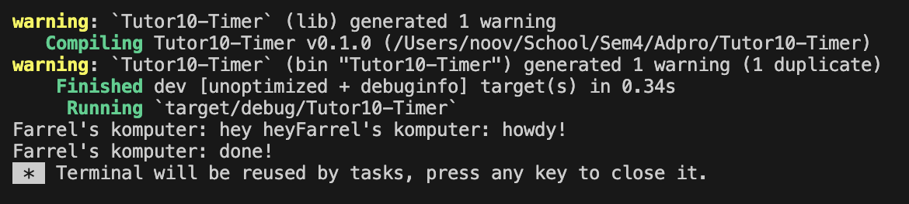
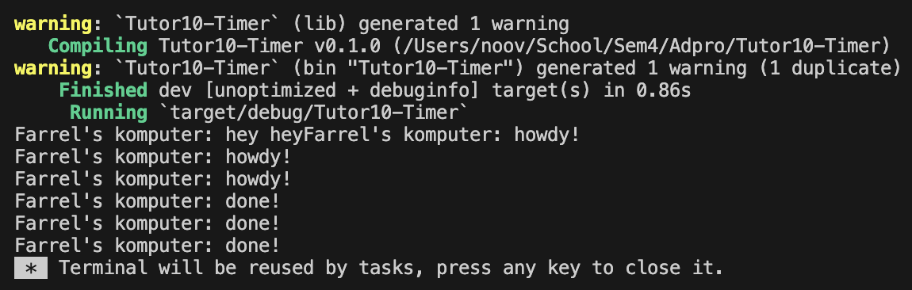

### Experiment 1.2

Output dari main mengconcatenate 'hey hey' dengan 'howdy!', ini dikarenakan cara kerjanya spawner yang asynchronus, karena hey hey tidak berada di dalam spawner dan tidak merupakan task yang dikerjakan secara async, maka dieksekusi langsung, sementara line print pertama `howdy` di poll oleh executor, setelah di spawn, dan setelah futureTimer selesai, maka `done!` di print setelah 2 detik (sesuai futuretimer).
Semua async program dijalankan dengan executor dan tidak peduli dengan urutan task di code. karena ini println hey hey langsung dijalankan 

Sekali lagi 'hey hey' di print terlebih dahulu.
Menambahkan instan spawner 2x, membuat howdy dan done! di print 3 kali, ini dikarenakan 3 async task yang dibuat oleh spawner menggunakan `.spawn`,dimana dia akan print howdy lalu done! setelah 2 detik karena futuretimer, ini sama untuk semua task dan dieksekusi satu persatu dengan executor.
Drop menandakan bahwa tidak akan ada lagi `Task` yang akan dikirim lagi. Jika kita remove `drop` spawner maka channel akan terus terbuka dan run dari executor akan terus berjalan, maka program tidak akan berhenti bahkan saat semua task sudah selesai.